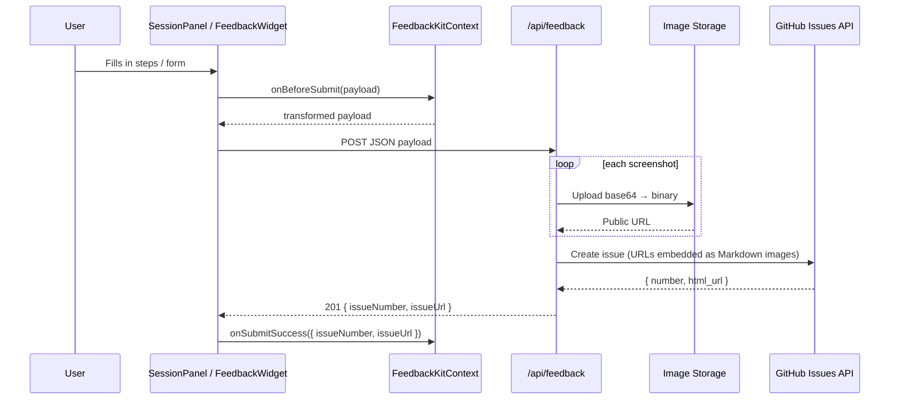

# Architecture Overview

---

## Package structure

```
feedback-kit/
├── src/
│   ├── components/
│   │   ├── SessionPanel.tsx        # slide-out task panel
│   │   └── FeedbackWidget.tsx      # floating report button + form
│   ├── renderers/                  # step type renderer registry
│   │   ├── index.ts                # defaultStepRenderers map
│   │   ├── TodoStep.tsx
│   │   ├── RatingStep.tsx
│   │   ├── YesNoStep.tsx
│   │   └── QuestionStep.tsx
│   ├── context/
│   │   └── FeedbackKitProvider.tsx # React context — apiEndpoint, theme, hooks
│   ├── lib/
│   │   └── utils.ts                # cn() Tailwind merge helper
│   ├── types/
│   │   └── index.ts                # all exported TypeScript types
│   └── index.ts                    # public barrel export
├── api-templates/
│   ├── vercel.ts                   # drop-in Vercel serverless function
│   └── express.ts                  # drop-in Express route
├── docs/                           # MkDocs source
├── examples/
│   └── building-configurator/      # reference consumer app
├── package.json
├── tsconfig.json
└── vite.config.ts                  # library mode build
```

---

## Data flow — single submission



---

## Extension points

The package is designed so new capabilities are added at defined seams, not by editing core components:

| Extension point | How to use | What it enables |
|---|---|---|
| `stepRenderers` prop | Pass a map of `type → Component` | New step types in SessionPanel |
| `onBeforeSubmit` hook | Return modified payload | Enrich submissions with app context |
| `onSubmitSuccess` hook | Callback with issue details | Analytics, toasts, redirects |
| `onSubmitError` hook | Callback with error | Error reporting, retry logic |
| `theme` config | Colours, position, label | Visual adaptation to host app |
| `apiEndpoint` prop | Any URL | Switch between environments |

---

## Separation of concerns

```
┌─────────────────────────────────────┐
│  Your app                            │
│  tasks.config.ts   ← domain config  │
│  feedback.ts       ← API template   │
└──────────────┬──────────────────────┘
               │ installs
┌──────────────▼──────────────────────┐
│  feedback-kit                        │
│  SessionPanel  FeedbackWidget        │
│  ← UI only, no domain knowledge →   │
└──────────────┬──────────────────────┘
               │ POST
┌──────────────▼──────────────────────┐
│  GitHub Issues + Actions             │
│  ← fully independent of hosting →   │
└─────────────────────────────────────┘
```

The components know nothing about your app's domain. The API template knows nothing about the UI. The GitHub Actions workflows know nothing about either — they only consume the issue events GitHub emits.
