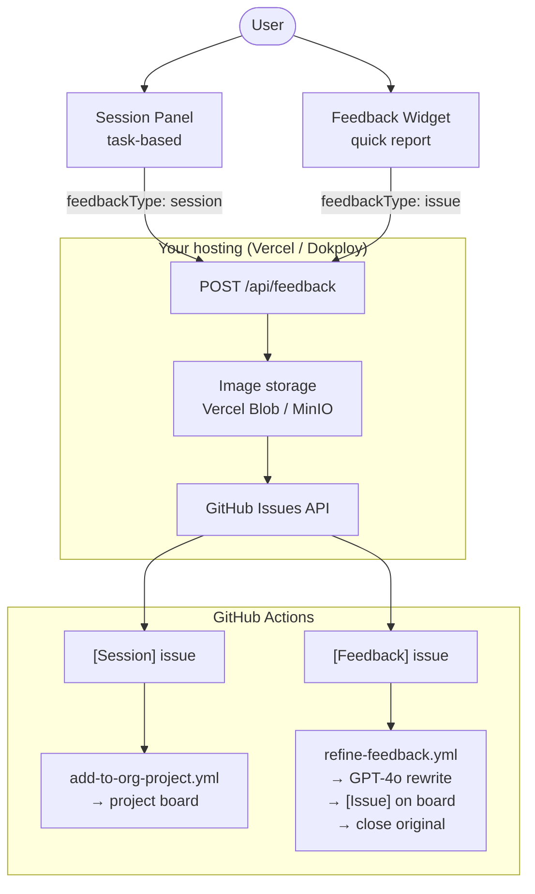
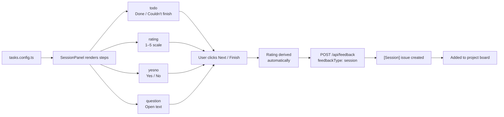
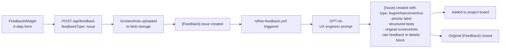

# Feedback Pipeline

End-to-end flow from an in-app interaction to a structured card on the project board.

---

## Two entry points, two issue types



---

## Session Panel flow



Session data is preserved raw — no AI processing — so researcher analysis can work from the original user responses.

---

## Feedback Widget flow



---

## AI refinement detail

The raw `[Feedback]` issue body is sent to GPT-4o (via GitHub Models) with a senior UX engineer system prompt. The model returns structured JSON:

```
title     → refined issue title
type      → bug | enhancement | ux
priority  → low | medium | high | critical
body      → Markdown with:
              Summary
              User Goal
              Observed Behaviour
              Expected Behaviour
              Steps to Reproduce
              Affected Component
              Suggested Fix
              Priority Rationale
```

The refined `[Issue]` keeps the original screenshots and folds the raw feedback into a collapsible `<details>` block for traceability.

The workflow skips bot-created issues to avoid trigger loops when it creates the refined `[Issue]`.

---

## Issue label reference

| Label | Applied by | Meaning |
|---|---|---|
| `session-data` | API | Issue contains raw session data |
| `user-feedback` | API | Issue is a raw feedback report |
| `ux` | API | Feedback Widget submission |
| `feedback: easy` | API | Difficulty rating 1–2 |
| `feedback: moderate` | API | Difficulty rating 3 |
| `feedback: hard` | API | Difficulty rating 4 |
| `feedback: blocked` | API | Difficulty rating 5 |
| `bug` / `enhancement` / `ux` | Actions (refined) | Issue type from GPT-4o |
| `priority: low/medium/high/critical` | Actions (refined) | Priority from GPT-4o |

---

## GitHub Actions workflows

| Workflow | Trigger | Input | Output |
|---|---|---|---|
| `add-to-org-project.yml` | Any issue/PR opened (not `[Feedback]`) | `[Session]` issues, PRs | Project board card |
| `refine-feedback.yml` | `[Feedback]` issue opened (human only) | Raw feedback body | Refined `[Issue]` + project card |

### Required secrets

| Secret | Scope | Used by |
|---|---|---|
| `ADD_TO_PROJECT_PAT` | `project` (org level) | Both workflows |
| `GITHUB_TOKEN` | Automatic | Provided by Actions runtime |
