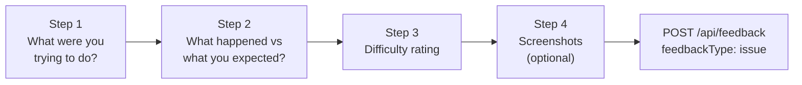

# FeedbackWidget

A floating button fixed to the bottom-right of the viewport. Opens a 4-step form for ad-hoc bug reports and usability observations, independent of any session task. Each submitted report creates a `[Feedback]` GitHub issue, which is then refined by GPT-4o into a structured `[Issue]` developer ticket.

---

## Usage

```tsx
import { FeedbackWidget } from '@thd-spatial-ai/feedback-kit'

function MyComponent() {
  return (
    <>
      <MyContent />
      <FeedbackWidget view="MyComponent" />
    </>
  )
}
```

---

## Props

| Prop | Type | Required | Description |
|---|---|---|---|
| `view` | `string` | Yes | Current screen name, attached to every issue |
| `context` | `string` | No | Additional context string (e.g. active sub-tab) |
| `taskTrigger` | `TaskTrigger \| null` | No | Pre-fills and opens the widget from a task |
| `onTaskTriggerConsumed` | `() => void` | No | Called after the trigger has been applied |
| `onSubmitted` | `() => void` | No | Called after successful submission |
| `apiEndpoint` | `string` | No | Overrides provider value |

---

## Form flow



The widget captures `view`, `context`, and `url` automatically — the user only fills in the four steps.

---

## Screenshots

Step 4 offers two screenshot options:

- **Capture screen** — uses `getDisplayMedia` to grab a frame, then shows a crop overlay so the user can select a region
- **Upload images** — file picker accepting PNG, JPEG, WEBP

Screenshots are sent as base64 in the payload. The API converts them to binary, uploads to blob storage, and embeds the public URLs in the issue body as inline Markdown images.

---

## Task trigger

The widget can be opened and pre-filled programmatically — for example, from a "Report an issue" button inside the `SessionPanel`:

```tsx
const [trigger, setTrigger] = useState<TaskTrigger | null>(null)

<FeedbackWidget
  view="MyComponent"
  taskTrigger={trigger}
  onTaskTriggerConsumed={() => setTrigger(null)}
/>
```

The `prefillGoal` field of the trigger populates Step 1 automatically, and the task context is attached to the submitted issue.

---

## GitHub issue output

Each submission creates a `[Feedback]` issue:

- **Title:** `[Feedback] <user goal>`
- **Body:** goal, observed behaviour, difficulty rating, screenshots
- **Labels:** `user-feedback`, `ux`, difficulty label

The `refine-feedback.yml` Actions workflow then:

1. Sends the body to GPT-4o with a UX engineer system prompt
2. Creates a refined `[Issue]` with type, priority, structured body, and original screenshots
3. Adds the `[Issue]` to the project board
4. Closes the original `[Feedback]` issue
