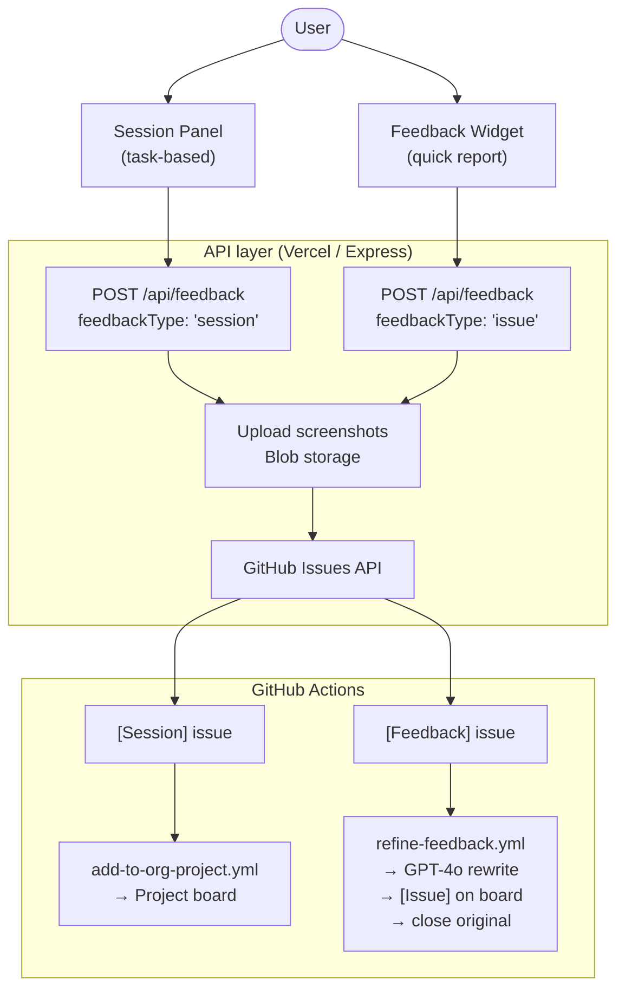
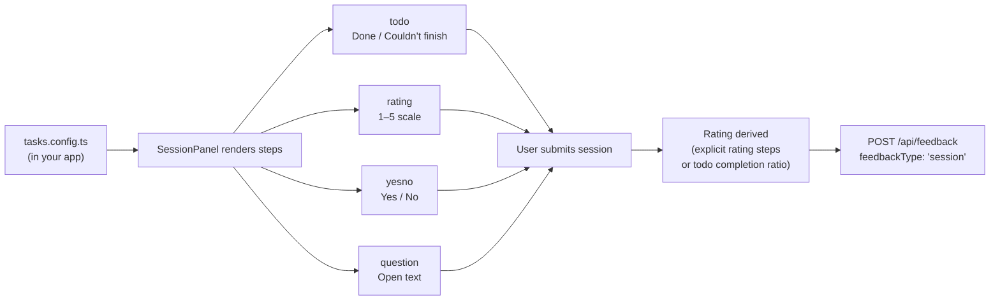
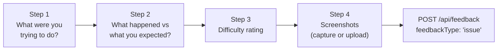
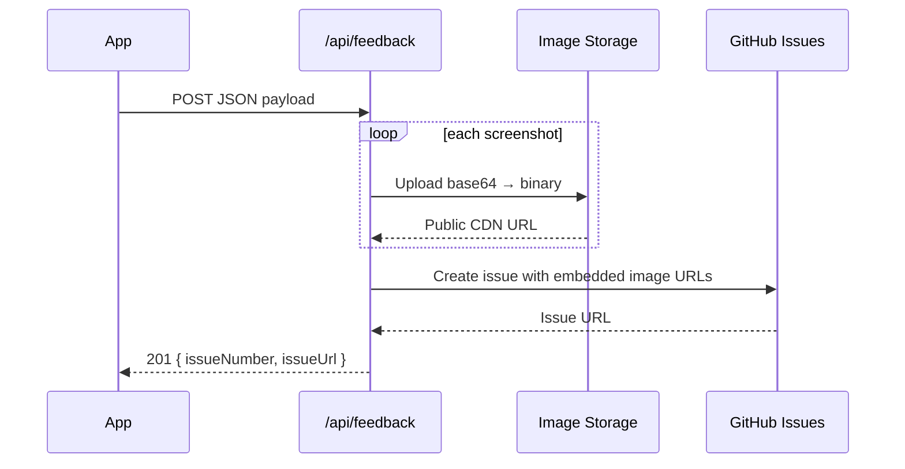
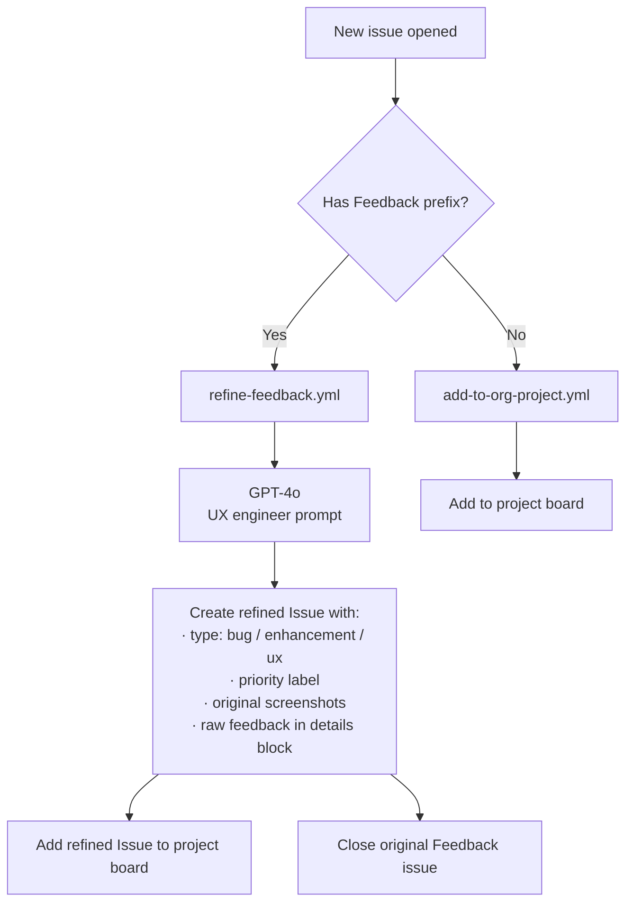

# Feedback Pipeline

End-to-end system for collecting, storing, and triaging user feedback — from an in-app interaction to a structured card on the organisation project board, with no manual steps.

---

## How it works

There are **two entry points** and they produce **two different issue types**. Both go through the same API layer, but are handled differently downstream.



---

## Entry points

| | Session Panel | Feedback Widget |
|---|---|---|
| **Component** | `<SessionPanel>` | `<FeedbackWidget>` |
| **Trigger** | Sidebar tab (right edge) | Floating button (bottom-right) |
| **Mode** | Guided task walkthrough | Free-form 4-step form |
| **Issue type** | `[Session]` | `[Feedback]` |
| **AI refinement** | No — raw data preserved | Yes — rewritten by GPT-4o |
| **Project board** | `add-to-org-project.yml` | `refine-feedback.yml` |

---

## Entry point 1 — Session Panel (task-based)

Each testing session is structured around a named task. The user works through a series of steps, answers inline questions, and submits at the end. Every session produces one `[Session]` GitHub issue.

### Task flow



### Step types

| Type | UI | Captured data |
|---|---|---|
| `todo` | Done / Couldn't finish + optional reason | `status`, `comment` |
| `rating` | 1–5 colour scale with axis labels | `rating` |
| `yesno` | Yes / No + optional follow-up | `answer`, `comment` |
| `question` | Free-text area | `response` |

### Session rating derivation

The overall session rating is derived automatically — users do not set it manually.

```
If explicit 'rating' steps exist → average of those values (inverted: 5 = easy → severity 1)
Otherwise                        → todo completion ratio → mapped to 1–5 severity scale
```

This becomes the difficulty label on the GitHub issue.

---

## Entry point 2 — Feedback Widget (quick report)

A lightweight 4-step form for ad-hoc issue reports, independent of any task session.



The widget captures `view` (current screen), `context`, and `url` from the app automatically — no manual tagging needed.

---

## API layer

**File:** `api-templates/vercel.ts` (Vercel) or `api-templates/express.ts` (self-hosted)



### Issue formats

| Field | `[Session]` issue | `[Feedback]` issue |
|---|---|---|
| **Title** | `[Session] <task title>` | `[Feedback] <user goal>` |
| **Body** | Task metadata + step-by-step results table | Goal, result, difficulty, screenshots |
| **Labels** | `session-data`, task ID | `user-feedback`, `ux`, difficulty label |

### Difficulty labels

| Rating | Label |
|---|---|
| 1–2 | `feedback: easy` |
| 3 | `feedback: moderate` |
| 4 | `feedback: hard` |
| 5 | `feedback: blocked` |

### Environment variables

| Variable | Purpose |
|---|---|
| `GITHUB_TOKEN` | PAT with Issues: read/write |
| `GITHUB_OWNER` | e.g. `THD-Spatial-AI` |
| `GITHUB_REPO` | e.g. `building-configurator` |
| `BLOB_READ_WRITE_TOKEN` | Auto-provisioned when Vercel Blob store is linked |

For self-hosted (MinIO/S3), see the [Self-Hosting guide](architecture/self-hosting.md).

---

## GitHub Actions



### Workflows

| Workflow | Trigger | Handles | Output |
|---|---|---|---|
| `refine-feedback.yml` | `[Feedback]` issue opened (human only) | Bug reports | Refined `[Issue]`, project card, closes raw |
| `add-to-org-project.yml` | Any issue/PR opened (except `[Feedback]`) | Sessions, PRs, regular issues | Project card |

### AI refinement

The raw feedback body is sent to GPT-4o (via GitHub Models) with a senior UX engineer system prompt. The model returns structured JSON:

```
title     → refined issue title
type      → bug | enhancement | ux
priority  → low | medium | high | critical
body      → Markdown with:
              Summary · User Goal · Observed Behaviour
              Expected Behaviour · Steps to Reproduce
              Affected Component · Suggested Fix · Priority Rationale
```

The refined issue preserves the original screenshots and folds the raw feedback into a collapsible `<details>` block for traceability.

!!! note "Bot loop prevention"
    `refine-feedback.yml` skips bot-created issues (actor check) to prevent trigger loops when the workflow itself creates the refined `[Issue]`.

### Required secrets

| Secret | Scope | Used by |
|---|---|---|
| `ADD_TO_PROJECT_PAT` | `project` (org level) | Both workflows |
| `GITHUB_TOKEN` | Automatic | Provided by Actions runtime |

---

## Payload reference

Both entry points POST to the same endpoint. The `feedbackType` field determines downstream behaviour.

| Field | Type | Required | Notes |
|---|---|---|---|
| `feedbackType` | `'issue' \| 'session'` | Yes | Routes issue format |
| `goal` | `string` | Yes | User's stated objective |
| `result` | `string` | Yes | What happened |
| `rating` | `1–5` | Yes | Difficulty / severity |
| `view` | `string` | Yes | Current screen name |
| `context` | `string` | Yes | Additional context string |
| `url` | `string` | Yes | Page URL at submission |
| `timestamp` | `string` | Yes | ISO 8601 |
| `screenshots` | `ScreenshotPayload[]` | No | base64 + mimeType |
| `taskId` | `string` | Session only | Links to task config |
| `taskTitle` | `string` | Session only | Human-readable title |
| `subtaskResults` | `SubtaskResult[]` | Session only | Per-step responses |
| `additionalComment` | `string` | No | Free-text observation |
