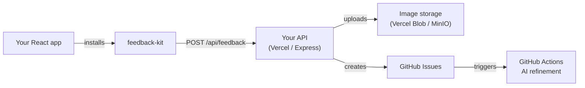
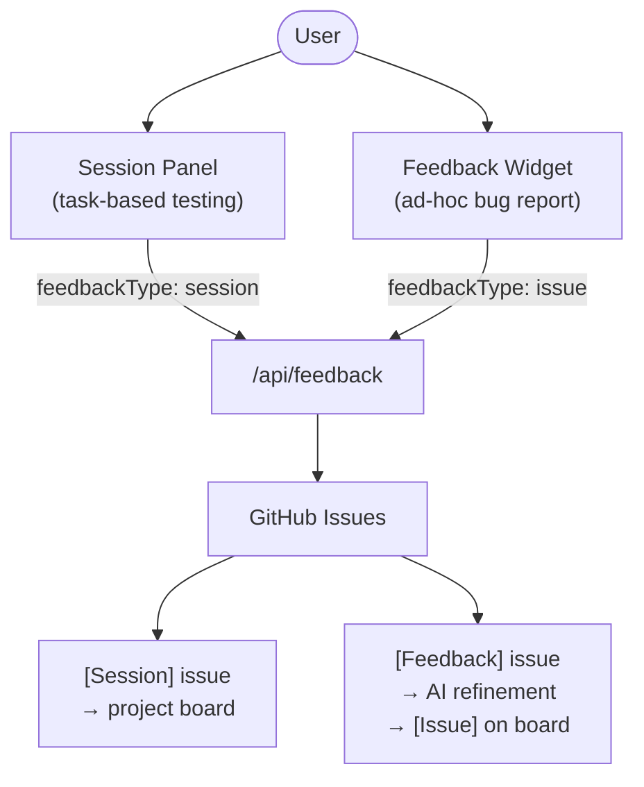

# feedback-kit

Drop-in React components for collecting structured user feedback as GitHub Issues — no external service, no SaaS subscription.

---

## What it does

**feedback-kit** gives any React app two independent feedback collection tools:

| Component | What it is | Output |
|---|---|---|
| `<SessionPanel>` | Guided task walkthrough — right-hand slide-out panel | `[Session]` GitHub Issue |
| `<FeedbackWidget>` | Floating bug report button — 4-step form | `[Feedback]` GitHub Issue |

Both submit to a single API endpoint (`/api/feedback`) that you deploy alongside your app. A GitHub Actions workflow then refines `[Feedback]` issues using GPT-4o into structured developer tickets.

---

## How it fits into your stack



The components are UI only — they know nothing about your app's domain. You supply the tasks config and wire up the API endpoint.

---

## Two entry points



You can install both or just one.

---

## Quick install

```bash
npm install @thd-spatial-ai/feedback-kit
```

Then wrap your app with the provider and drop in whichever components you need:

```tsx
import { FeedbackKitProvider, SessionPanel, FeedbackWidget } from '@thd-spatial-ai/feedback-kit'
import { myTasks } from './tasks.config'

export function App() {
  return (
    <FeedbackKitProvider apiEndpoint="/api/feedback">
      <YourApp />
      <SessionPanel tasks={myTasks} view="MyComponent" />
      <FeedbackWidget view="MyComponent" />
    </FeedbackKitProvider>
  )
}
```

See [Quick Start](getting-started/quick-start.md) for the full setup.
